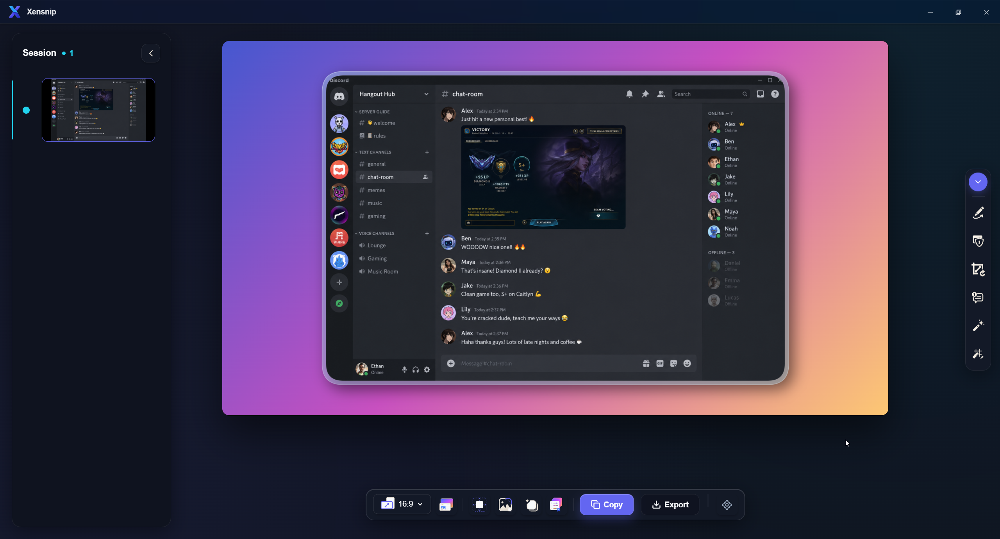
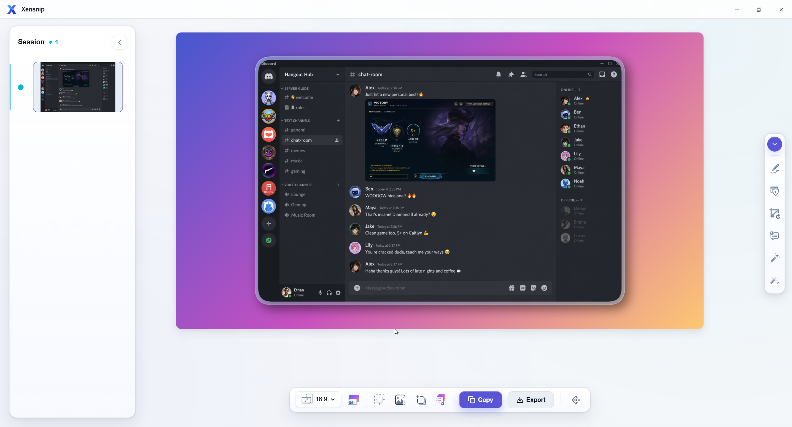

# XenSnip

[](https://github.com/BiViPi/xensnip/actions/workflows/ci.yml)

XenSnip is a Windows screenshot tool built for fast capture, clean annotation, and polished export.

It lives in the system tray, captures regions or the active window with global hotkeys, opens a quick-access editor, and lets you turn raw screenshots into presentation-ready visuals without leaving your desktop workflow.

## Preview

### Dark Theme



### Light Theme



## Version

Current release: `0.2.1`

## What XenSnip Does

- Capture a screen region or the active window
- Open a quick-access editor immediately after capture
- Annotate screenshots with arrows, rectangles, text, callouts, steps, and freehand arrows
- Hide sensitive information with blur, pixelate, or opaque redact tools
- Style screenshots with gradients, wallpaper backgrounds, padding, borders, and shadows
- Copy the final result to the clipboard or export it to disk
- Reuse and manage visual presets across captures
- Extract text from a selected area with OCR

## Download

For normal use, download the latest Windows installer from GitHub Releases:

- Release page: [GitHub Releases](https://github.com/BiViPi/xensnip/releases)
- Landing page: [XenSnip landing page](https://xensnip-landing-page.vercel.app/)

The `0.2.1` release is intended to be distributed as installer packages rather than as a source-only package.

Release package formats:

- NSIS installer (`.exe`)
- MSI package (`.msi`)

## Platform

- Windows 10 (build `19041+`) or Windows 11
- WebView2 runtime

Windows 11 normally includes WebView2 already. On Windows 10, the Tauri installer can install it as part of setup if it is missing.

## Default Hotkeys

| Action | Shortcut |
|--------|----------|
| Region capture | `Ctrl+Shift+S` |
| Active window capture | `Ctrl+Alt+W` |

Both shortcuts can be changed in the Settings window.

## Typical Workflow

1. Launch XenSnip and leave it running in the system tray.
2. Trigger a capture with a hotkey or from the tray menu.
3. Review the capture in the quick-access editor.
4. Annotate, redact, and style the screenshot as needed.
5. Copy or export the final image.

## OCR

XenSnip includes OCR text extraction for selected regions.

Important notes:

- OCR runs locally through `Tesseract.js`
- On first use in a session, the OCR model is downloaded from `cdn.jsdelivr.net`
- Screenshot content is not uploaded to a remote OCR service
- OCR accuracy depends on font size, contrast, scaling, and language

## Privacy

- Captures stay in memory unless you explicitly export or save them
- Settings are stored locally at `%APPDATA%\XenSnip\settings.json`
- Logs are stored at `%APPDATA%\XenSnip\logs\`
- XenSnip does not include analytics or telemetry

## Install From Source

### Prerequisites

- Node.js `20+`
- Rust stable
- Visual Studio C++ Build Tools for Tauri on Windows

### Development

```bash
pnpm install
pnpm run tauri dev
```

### Production Build

```bash
pnpm install
pnpm run tauri build
```

Windows bundle artifacts are generated under:

```text
src-tauri/target/release/bundle/
```

## Verification

Before cutting a release, run:

```bash
pnpm test
pnpm run build
cargo test --manifest-path src-tauri/Cargo.toml
cargo clippy --manifest-path src-tauri/Cargo.toml -- -D warnings
pnpm tauri build -b nsis msi --ci --no-sign
```

## Known Limitations

- Some protected or hardware-accelerated windows may capture as black or empty due to Windows restrictions
- OCR is best-effort and should not be treated as a guaranteed extraction layer
- XenSnip is currently Windows-only

## Reset Or Uninstall

Reset settings:

- Delete or rename `%APPDATA%\XenSnip\settings.json`

Full uninstall:

1. Uninstall XenSnip from Windows Settings
2. Delete `%APPDATA%\XenSnip\` if you also want to remove settings and logs

## License

MIT. See [LICENSE](LICENSE).
